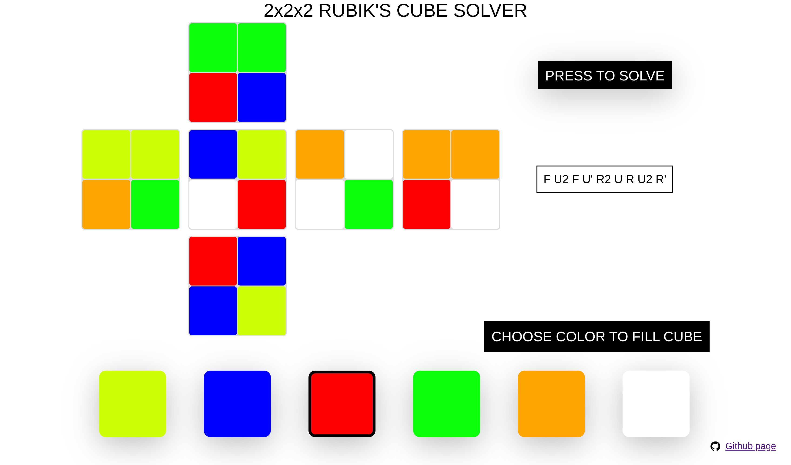

  

# Fast and simple 2x2x2 Rubik's solver with basic UI

A 2x2x2 cube solver written in Go to find the optimal solution. The solution requires only moves of R, U and F faces.

### Run
    $ make run
after open in any browser http://localhost:8080/

### Screenshot

### Algorithm explanation
Only the moves R, R2, R', U, U2, U', F, F2, F' are used. With such a set of allowed moves, the cube can be solved in [11 face turns](https://www.jaapsch.net/puzzles/cube2.htm#:~:text=It%20shows%20that%20every%20position%20can%20be%20solved%20in%20at%20most%2011%20moves). The algorithm itself is a brut force based on bidirectional breadth first search (BFS) with storing all intermediate positions in the hash table:
* The first BFS started from disassembled cube with a maximum depth of 6.
* The second BFS started from assembled cube with a maximum depth of 5.

The second BFS significantly reduce the calculations required to find a solution by decreasing 'breadth' of the first BFS.

### Tests
To run tests:

    $ make test

You can adjust the number of batches which will be running simultaneously (BATCHES), their size (BATCHES_SIZE) and scramble length (SCRAMBLE_LENGTH)

### Packages used
* [GoDotEnv](https://github.com/joho/godotenv)
* [Testify](https://github.com/stretchr/testify)